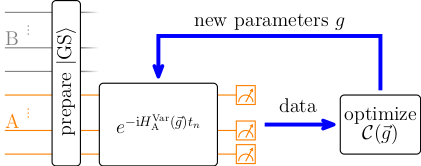

# QuantVarEntHam.jl Documentation

# What? 

This package aims to find the Entanglement Hamiltonian (EH) of one dimensional spin lattice models with arbitry spin. 
Kokail et al. presented the algorithm -a Quantum Classical Feedback Loop (QCFL)- , which is the foundation for this package.
It learns the EH by minimizing the time evolution of observables. 
The time evolution and the monitoring of observables is the quantum part, while the classical minimization of a cost function is the classical part.
For benchmarking, there are more cost functions implemented besides the [`QCFL`](@ref) (see [`Commutator`](@ref), [`RelativeEntropy`](@ref)).


# Installation

Clone the repo 
```
git clone git@gitlab.dlr.de:ma-kind/QuantVarEntHam.git
```
and navigate in to the folder `QuantVarEntHam`.
Add the package via the package manager 
```
] add .
```
Test wether the installation was succesfull in the REPL
```jldoctest
julia> using QuantVarEntHam

julia> PauliString(4,"Z",(1,2))
Pauli string
Spin 1//2
Number of spins: 4

Z₁⊗ Z₂
```
# Theory in short

This section gives a basic understanding of the fundamental algorithm of this package.
For more information see the paper from Kokail et al.[PhysRevLett.127.170501](@cite),
where the algorithm first appeared or the preprint of Kind and Fauseweh[kind2025exploringvariationalentanglementhamiltonians](@cite),
where the algorithm was improved and for which this package was written.

Given a composite Hilbert space ``\mathscr{H} = \mathscr{H}_\text{A} \otimes \mathscr{H}_\text{B}``, a general quantum state 
after a Schmidt decomposition can be written as 
```math 
| \Psi \rangle  = \sum_{\alpha = 1}^{\chi} e^{-\xi_{\alpha}/2} | \Phi^{\alpha}_\text{A} \rangle  \otimes | \Phi^{\alpha}_\text{B} \rangle,
```
where ``\chi`` is called the Schmidt rank.
Tracing out the degrees of freedom related to subsystem B in the quantum state 
``\rho = | \Psi \rangle \langle \Psi |``, 
the reduced density matrix on subsystem A reads 
```math 
    \rho_\text{A} = \text{Tr}_\text{B} \left [ \rho \right ] = \sum_{\alpha} e^{-\xi_{\alpha}} | \Phi_\text{A}^{\alpha} \rangle \langle  \Phi_\text{A}^{\alpha} | 
   =\mathrel{\mathop:} e^{-H_\text{A}},
``` 
which defines the EH ``H_\text{A}``on subsystem A.
Its spectrum -the Entanglement spectrum- ``\{ \xi_{\alpha} \}``is the target quantity of this algorithm and gives insights about topological phases.

Obtaining the Entanglement is in general, especially for lattice models, very hard. 
The QCFL aims to find the EH by monitorng observables after evolvoing the subsystem A under a variational Ansatz.
Of course, one cannot just simply use an arbitrary ansatz.

In a ``d+1``-dimensional relativistic QFT with a local Hamiltonian-density $\mathcal{H}(\vec{x})$, the EH of the ground state for the special case of a bipartition of an infinite system A (A ``= \{ \vec{x} \in \mathbb{R}^d | x_1 > 0\}``)
the Bisognano-Wichmann theorem (BW theorem)[10.1063/1.522605, 10.1063/1.522898](@cite) predicts the EH to be
```math
    H_\text{A} = \int_\text{A} d^dx \, \beta(x_1) \mathcal{H}(\vec{x}) + c
```
with ``\beta(x_1) = 2\pi x_1``.
The additive constant `c` ensures that the reduced density matrix is normalized.
Lattice system are not continous in the spatial dimensions but rather discrete, breaking the Lorentz symmetry, s.t. that the BW-theorem needs to be discretized
```math
H_\text{A} \approx \sum_{i \in \text{A}} g_i h_i,
```
where the continous spatial coordinates ``\vec{x}`` and the local Hamiltonian-density ``\mathcal{H}(\vec{x})`` are cast to discrete parameters ``g_i``
and quasi-local few-body operators (called "blocks" in this package) ``h_i``, respectively.
The BW-theorem is the foundation for the ansatz [`H_A_BW`](@ref). 
However, corrections can lead to better convergence, see [`H_A_BWV`](@ref) for more information.

Given a variational Ansatz, a cost function for the QCFL is needed. 
Since the QCFL is based on minimizing the time variation of observables, i.e. enforcing ``\langle O_j^\text{A} \rangle_t = \text{const}``,
Kokail et al. proposed the cost function 
```math
\mathcal{C}(\vec{g}) = \sum_{j=1}^{N_O}\sum_{n=1}^{N_T} \left (\langle O^\text{A}_j\rangle_{t_n} - \langle O^\text{A}_j\rangle_0 \right )^2,
```
which samples the system at discrete time points.
However, Kind and Fauseweh proposed a cost function which is promoted to a continous integral over the time domain.
```math
\mathcal{C}(\vec{g}) = \frac{1}{T_\text{max}} \int_0^{T_\text{max}} \frac{1}{N_\text{O}} \sum_{j=1}^{N_\text{O}} \left ( \langle \mathcal{O}_j^\text{A} \rangle_t - \langle \mathcal{O}_j^\text{A} \rangle_0 \right ) dt,
```
since this often times allows better convergence (to be exact: the integral representation is needed if the variational Ansatz is not expressive enough and does not lead to a stationary).
The expectation value of the time evolved observables read 
```math 
\langle \mathcal{O}_j^\text{A} \rangle_t =  \text{Tr}_{\text{A}} \left [ \mathcal{O}_j^\text{A} e^{- i H_\text{A}^\text{Var}(\vec{g})t} \rho_\text{A}  e^{i H_\text{A}^\text{Var}(\vec{g})t} \right ],
```
where one can see that a cost function value of zero implies that the exact reduced density matrix and the variational ansatz commute. 

The QCFL consists of initializing the composite system in the ground state of the composite system Hamiltonian, then evolving the subsystem A 
under the variational Ansatz, then measuring the obsverables, evaluating the cost function 
and minimizing the cost function by varying the variational parameters ``\vec{g}`` (see the image below).



# References
```@bibliography
Pages = ["index.md"]
Canonical = false
```